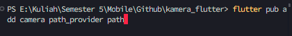
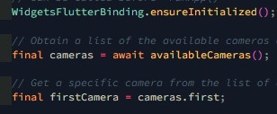
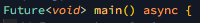
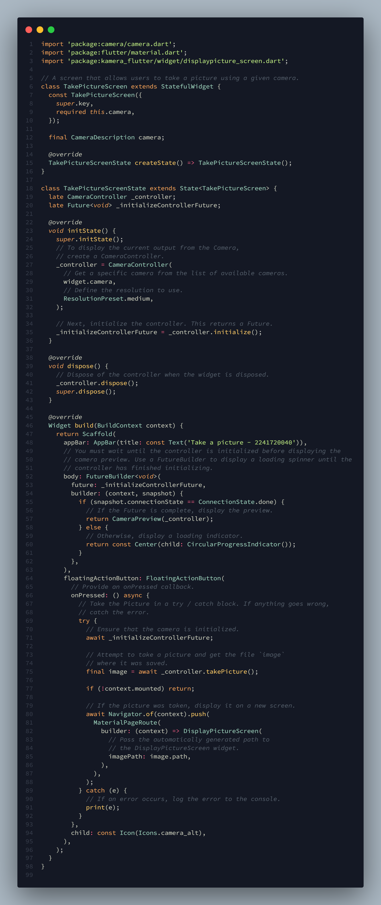
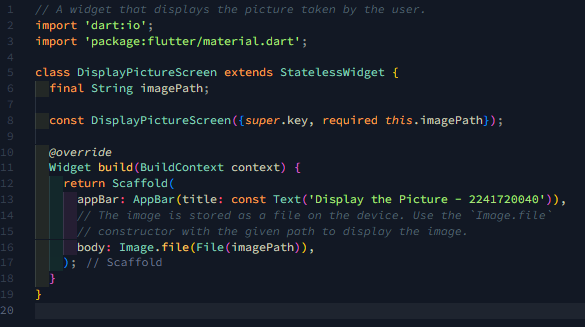
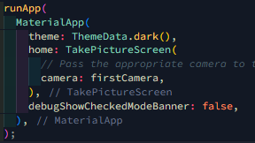
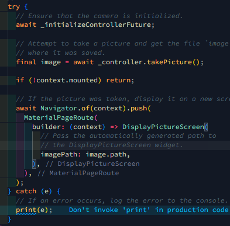

# Praktikum 1: Mengambil Foto dengan Kamera

## Langkah 1: Buat Project Baru

## Langkah 2: Tambah dependensi yang diperlukan 

 

## Langkah 3: Ambil Sensor Kamera dari device 

 
 

## Langkah 4: Buat dan inisialisasi CameraController 

## Langkah 5: Gunakan CameraPreview untuk menampilkan preview foto 

## Langkah 6: Ambil foto dengan CameraController 

Praktikum Langkah 4-6: 
 

## Langkah 7: Buat widget baru DisplayPictureScreen

 

## Langkah 8: Edit main.dart

 

## Langkah 9: Menampilkan hasil foto

 
 
 
